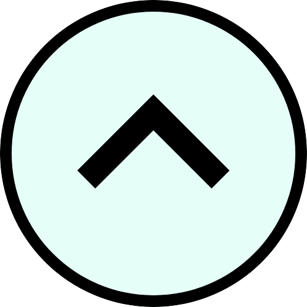
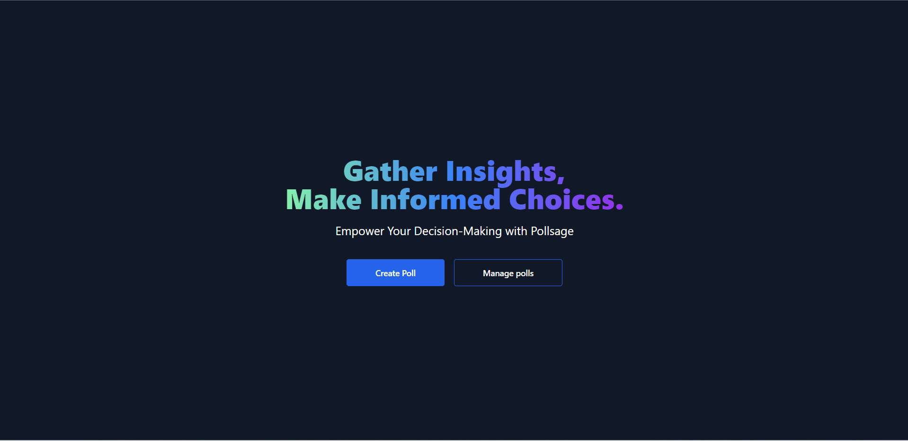

<h1 align="center">
	<br>
	<br>
	
	<br>
	<br>
	<br>
</h1>

# PollSage

PollSage is a web application that allows users to create and participate in polls. It provides a platform for users to gather opinions and make data-driven decisions.

## Features

- **User Registration and Authentication:** Users can create an account and log in to access the PollSage application. Passwords are securely hashed and stored in the database.
- **Create Polls:** Users can create polls by specifying the question and answer options. They can customize various settings for the poll, such as allowing multiple selections and setting an expiration date.
- **Vote on Polls:** Users can participate in polls by selecting their preferred answer option(s). They can choose a single option or multiple options based on the poll's configuration.
- **View Poll Results:** Users can view the results of a poll, including the number and percentage of votes for each option. The results are displayed in a visually appealing chart format.
- **Comment Sections:** Participants can provide additional feedback and comments on polls. They can express their thoughts, share insights, or ask questions related to the poll.

- **Draft Saving:** Users can save their polls as drafts and continue editing them later. This feature allows users to work on complex or time-consuming polls without losing progress.
- **Poll Expiration:** Poll creators can set a start and end date for their polls. This feature ensures that the poll is active and accepting votes only within the specified timeframe.
- **Poll Visibility:** Poll creators can choose to make their polls public or limit access to specific participants. They have the option to share the poll publicly or restrict it to a select group of individuals.
- **Password Protection:** Poll creators can add password protection to their polls. This feature ensures that only users with the correct password can participate in the poll.
- **Share Polls:** Users can easily share polls with others through social media or direct links. Sharing options include popular platforms like Facebook, Twitter, and email.
- **Poll Analytics:** The application provides detailed analytics and insights on poll participation and results. Creators can analyze voting patterns, demographics, and trends to gain valuable insights.

## Technologies Used

- **Back-end:** Node.js, Express.js
- **Front-end:** React.js, HTML, CSS, JavaScript
- **Database:** MongoDB (NoSQL)
- **Authentication:** JWT (JSON Web Tokens)
- **Other Libraries and Tools:** Axios, React Router, Chart.js, Socket.io, bcrypt (for password hashing), etc.

## Contribution

This project is open to contributions from anyone. If you would like to contribute, please follow the steps below:

1. Fork the repository
2. Clone the repository to your local machine
3. Create a new branch
4. Make your changes
5. Commit and push your changes to the remote repository
6. Create a pull request

## Installation

To run the application locally, you must have Docker installed on your machine. You can download Docker from [here](https://www.docker.com/).

#### 1. Clone the Repository

Clone the repository from GitHub to your local machine.

```
git clone https://github.com/your-username/pollsage.git
cd pollsage
```

#### 2. Docker Compose Setup

Make sure you have Docker and Docker Compose installed on your system.

#### 3. Build and Run

Use Docker Compose to build and run the containers:

```
docker-compose up --build
```

This command will build the images and start the containers for MongoDB, Redis, Backend, and Frontend.

## Screenshots




## License

This project is licensed under the MIT License. See the [LICENSE](https://github.com/theritikchoure/pollsage/blob/main/LICENSE)

## Contact

If you have any questions or suggestions, please feel free to contact me at [ritvikchoure65@gmail.com](mailto:ritvikchoure65@gmail.com)

## Acknowledgements

- [React.js](https://reactjs.org/)
- [Node.js](https://nodejs.org/en/)
- [Express.js](https://expressjs.com/)
- [MongoDB](https://www.mongodb.com/)
- [JWT](https://jwt.io/)
- [Axios](https://axios-http.com/)
- [React Router](https://reactrouter.com/)

## Authors

- [Ritik Chourasiya](https://github.com/theritikchoure)

## Support

If you like this project, please consider giving it a ⭐.
